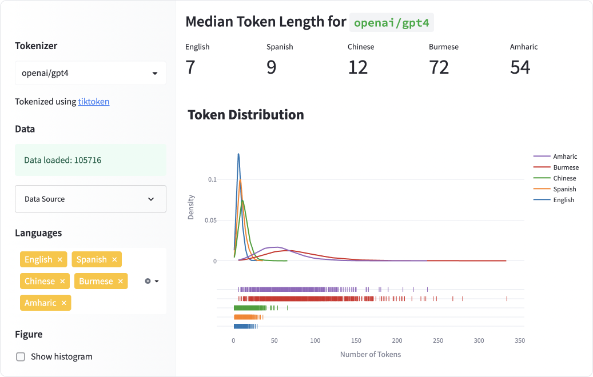
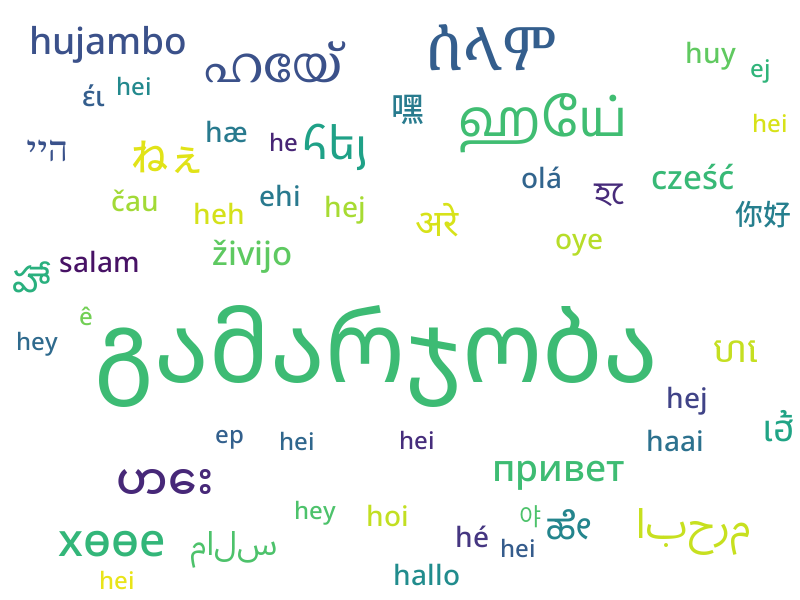

# LLM Tokenizers in Multiple Languages

This is the repo for the [HuggingFace Space](https://huggingface.co/spaces/yenniejun/tokenizers-languages) corresponding with the article, [All languages are NOT created (tokenized) equal](https://www.artfish.ai/p/all-languages-are-not-created-tokenized). 

The Space explores token length for various LLM tokenizers on many different languages.

### Introduction to the project
Large language models such as ChatGPT process and generate text sequences by first splitting the text into smaller units called tokens. This process of tokenization is not uniform across languages, leading to disparities in the number of tokens produced for equivalent expressions in different languages. For example, a sentence in Burmese or Amharic may require 10x more tokens than a similar message in English.

### Dataset
[MASSIVE](https://arxiv.org/abs/2204.08582) is a parallel dataset [introduced by Amazon](https://github.com/alexa/massive) consisting of 1 million realistic, parallel short texts translated across 52 languages and 18 domains. I used the dev split of the dataset, which consists of 2033 texts translated into each of the languages. The [dataset is available on HuggingFace](https://huggingface.co/datasets/AmazonScience/massive) and is licensed under the CC BY 4.0 license.

